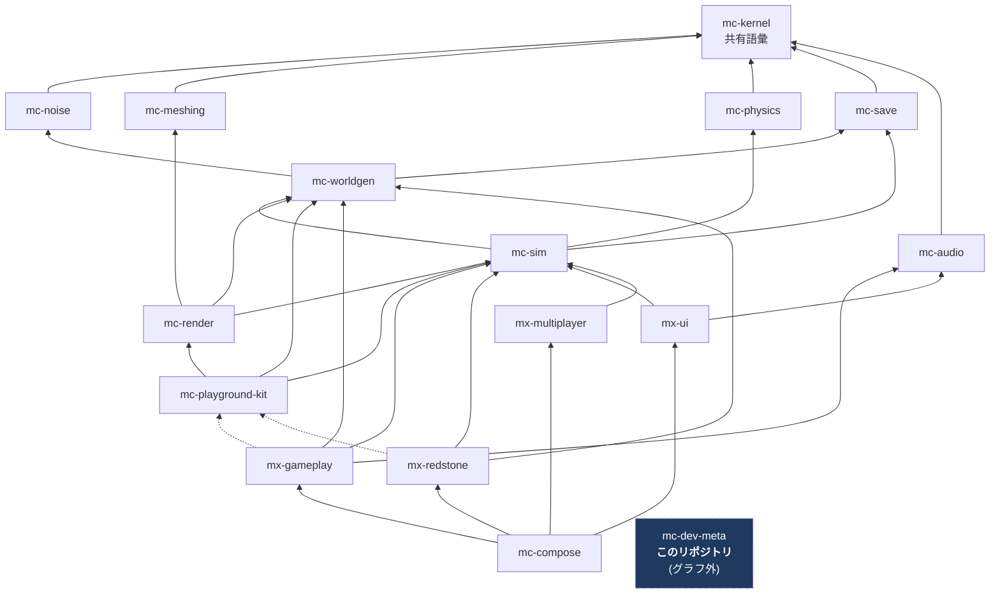

# アーキテクチャ

## 1. 4 階層アーキテクチャ

plan.md §2.2 の 4 階層。16 リポジトリはすべてこのいずれかに属する。

| 階層 | リポジトリ | 性質 |
| --- | --- | --- |
| 安定ライブラリ | mc-kernel / mc-noise / mc-meshing / mc-physics / mc-save / mc-audio | 純粋関数・狭い界面・変更頻度が低い。相互独立で並行構築可能 |
| 基盤 | mc-worldgen / mc-sim / mc-render / mc-playground-kit | 状態とサービス(**名詞**)。体験モジュールが乗る土台 |
| 体験モジュール | mx-gameplay / mx-redstone / mx-ui / mx-multiplayer | ルールと UI(**動詞**)。互いを知らず、基盤サービス経由でのみ会話する |
| 合成 | mc-compose | Layer マージ + stage 順序表 + E2E。ロジックを持たない |
| **(グラフ外)** | **mc-dev-meta** | **開発時ワークスペース束ね役。ゲームグラフには参加しない** |

この表は `domain/repository-roster.ts` に機械可読な形で入っており、
`test/roster.test.ts` が階層ごとの件数(6 / 4 / 4 / 1 / 1)を固定している。

## 2. 依存グラフ(16 リポジトリ全体)

実線 = 実行時依存(`dependencies`)、点線 = プレビュー起動時のみ(`devDependencies`)。
`mc-kernel` はどこからでも import 可能なため、エッジとしては描かない。



> **mc-kernel は全リポジトリから import 可能。** グラフに描かないのは、
> 全ノードから kernel へエッジを引くと図が読めなくなるためである。ただし
> `package.json` への記載は必要。この例外はロスター(`KERNEL_REPOSITORY`)にも表れる:
> どの `dependsOn` にも kernel を含めない、という形で宣言している。

このグラフは `domain/repository-roster.ts` の `DEPENDENCY_GRAPH` として機械可読な形で入っており、
`test/roster.test.ts` が

- 循環が無いこと(ビルド順が存在すること)
- ビルド順が plan.md §6 Step 2 と一致すること

を検証している。

## 3. このリポジトリの位置 ― グラフの外

**mc-dev-meta は依存を持たず、誰からも依存されない。**

15 リポジトリすべてを管理するツールが、それらの依存グラフの参加者であってはならない。
参加者だったら、ブートストラップに「自分が取ってくるためのパッケージ」が要ることになる。

そのため:

- `dependsOn` は空
- **`package.json` の `dependencies` が存在しない。** `effect` すら入っていない
- `pnpm-workspace.yaml` に自分自身を含めない(`packages: ['repos/*']` だけ)
- `private: true`。publish されない

`test/workspace.test.ts` がこの 4 つをすべて固定している。

### 3.1 それでもロスターを持つ

依存はしないが、**16 リポジトリの名前と依存グラフは知っている必要がある**
— それを clone し、workspace として束ねるのが仕事だからである。

そこで `domain/repository-roster.ts` が**ロスターの参照コピー**を持つ。

各リポジトリが `scripts/check-dependency-whitelist.ts` の中に、この依存グラフを
手書きでミラーした写しを持つ方式は org 全体で廃止された。Tier 境界の検査は今、
各リポジトリ自身の `.oxlintrc.json#no-restricted-imports` が担う(DEPENDENCY_POLICY.md) —
つまり「グラフを手書きでミラーして、参照コピーとの一致を検査する」という設計そのものが
このリポジトリの外では使われなくなった。

`domain/repository-roster.ts` は mc-dev-meta 自身の `pnpm sync` / `pnpm update:manifest` /
`pnpm check:workspace` / `pnpm check:mirrors` / `pnpm check:repoint` が読む内部の参照コピーとして
残る。他の 15 リポジトリへ配布・consume させる計画([workflow.md](./workflow.md) §5.4 が
記録していたもの)は、ミラー先だった `scripts/check-dependency-whitelist.ts` 自体が
無くなったことで前提が変わっており、現時点では未定である。

## 4. 設計ルール(16 リポジトリ共通)

### 4.1 基盤 = 名詞、体験 = 動詞(plan.md §2.3-1)

| | 置き場 | 例 |
| --- | --- | --- |
| **名詞**(状態の置き場・サービス) | 基盤(mc-sim / mc-worldgen / mc-render) | `InventoryService`、`EntityManager`、`ChunkManager` |
| **動詞**(ルール・振る舞い) | 体験モジュール(mx-*) | 「掘ったらドロップする」「回路に電力が伝わる」 |

体験モジュール間の依存エッジは**ゼロ**である。
「採掘 → インベントリに入る」は mx-gameplay → mx-ui の呼び出しではなく、
mc-sim の `InventoryService` を経由して実現する。

回帰テスト: `test/roster.test.ts` の `records no edge between any two experience modules`。

### 4.2 mc-playground-kit は devDependency 専用(plan.md §2.3-2)

`mc-playground-kit` は「ミニ平地ワールド + カメラ + レンダラ + 入力を 1 秒で束ねる糊」であり、
**プレビュー(dev アプリ)からのみ使う**。

`dependencies` に入れてはならない理由は具体的である:
**実行時入力サービスの所有者は mc-render であり、kit ではない**(plan.md §2.3-2)。
kit を実行時依存にすると、出荷ビルドが「同梱されないハーネス」から入力を取ることになり、
リリースビルドから入力処理が丸ごと消える。

ロスター上では `devDependsOn` にだけ現れ、`dependsOn` には**どのリポジトリでも**現れない。
参照するのは mx-gameplay と mx-redstone の 2 つだけである。

回帰テスト: `never lists mc-playground-kit as a runtime edge, only as a devDependency`。

### 4.3 stage 実行順序表は mc-compose が唯一所有(plan.md §2.3-3)

各モジュールは `after` で順序制約を宣言するだけで、全順序は mc-compose が解決する。
mc-dev-meta はこれに関与しない。

### 4.4 依存境界は CI で強制(plan.md §2.3-5)

各リポジトリ own の `scripts/check-dependency-whitelist.ts`(`pnpm check:deps`)が
違反を非ゼロ終了で検査する方式は org 全体で廃止された。今は各リポジトリの
`.oxlintrc.json#no-restricted-imports` が Tier 境界を検査する(DEPENDENCY_POLICY.md)。
参照実装の `check-package-dag.ts` は警告を出して常に 0 で終了していた
— 落ちないゲートはドキュメントであってゲートではない、という原則自体は変わらない。

mc-dev-meta は依存グラフの外(層外)にあり、`@nerima-games/*` を 1 つも import しないため、
`.oxlintrc.json` に Tier 境界の追加エントリを持たない。「何も import していないこと」は
`test/workspace.test.ts` の `declares no runtime dependencies at all` が検査する。

## 5. 参照実装との対比

参照実装 `takeokunn/ts-minecraft` は **1 リポジトリ 11 パッケージ**の pnpm workspace だった:

```console
$ cat pnpm-workspace.yaml
packages:
  - 'packages/*'
$ ls packages/
app  block  core  entity  game  inventory  network  presentation  rendering  worker  world
```

実測 87,712 本体 LOC / 131,037 テスト LOC。

**mc-dev-meta は `packages/*` を `repos/*` に置き換えたものである。**
開発中の解決の即時性は同じで、検証とリリースの単位だけが 16 に分かれる。

| | 参照実装 | 新構成 |
| --- | --- | --- |
| workspace glob | `packages/*` | `repos/*`(mc-dev-meta 内) |
| 検証の単位 | 1 リポジトリ 87k LOC | 16 リポジトリ |
| CI の単位 | 1 本 | 16 本 |
| 開発中の依存解決 | workspace | workspace(**同じ**) |
| 合成状態の記録 | git のコミット 1 つ | **`repos.json`** |

最後の行が、この構成が新しく必要とした唯一のものである。
モノレポではコミット 1 つが合成状態そのものだった。
16 リポジトリではそれが失われるので、[manifest.md](./manifest.md) の仕組みで取り戻す。
